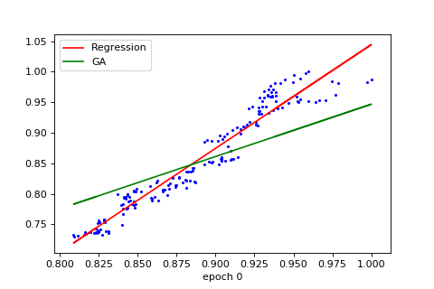

## Using Genetic Algorithms for Linear Regression
This is a simple example of the application of genetic algorithms in the approximation of the best fitting line to a set of datapoints. While the best fitting line can be solved with much faster methods like Ordinary Least Squares, this shows the wide application of genetic algorithms in optimization problems. This approach can be also considered as a substitute for gradient descent especially when the gradient of the loss function is not entirely defined over the parameter space.

The used dataset is the exchange rates of USD to 3 other currencies per given day.
